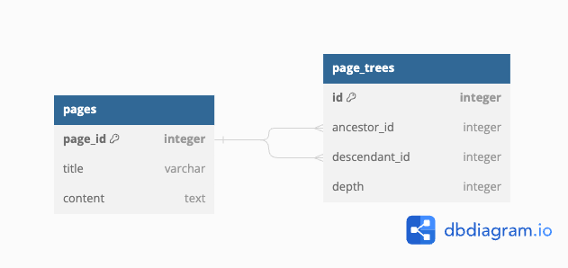

# notion-be
 imitate notion pages' backend service

# pages 
notion의 pages를 계층형 구조로 추상화하였다. 이를 RDB로 표현하기 위하여 closure pattern을 사용하였다.
[참고 : 계층 구조 모델을 DB에서 구현하는 방법](https://www.slideshare.net/billkarwin/models-for-hierarchical-data)

DB closure pattern의 장점은 다음과 같다.

- page에서는 page와 관련한 로직만 처리하고, **계층 구조는 별도의 테이블에서 관리 (역할 분담)** → 여러 기능들을 각각의 CRUD로 처리할 수 있음
- 재귀나 반복 없이 breadcrumbs select 가능

만약 parent_id를 갖는 테이블을 구성할 경우, 모든 breadcrumbs 가져오기 힘들다. 일일이 JOIN하거나(혹은 MySQL 재귀 함수 이용), 반복문으로 select 결과를 이용해야한다.

## DB schema



depth 컬럼을 추가하여 breadcrumbs를 구할 때 최소 탐색을 수행할 수 있다.

## raw sql in django

django model은 사용하되, sql을 직접 execute하기 위하여 `django.db`의 `connection` 을 이용하였다.
[참고 : django custom sql 공식문서](https://docs.djangoproject.com/en/4.2/topics/db/sql/#executing-custom-sql-directly)


## 장점 

테이블을 정규화하여 페이지 내용과 계층구조를 분리할 수 있다.

특정 페이지의 모든 자식, 부모를 찾는 경우에도 빠르게 수행할 수 있다.

이후, 페이지를 옮기거나 삭제하는 기능 확장에 유연하다.

## 단점
insert시에 최악의 경우 최대깊이인 O(n) 이 걸릴 수 있으며, 저장공간이 크다. 하지만 select가 더 자주 호출 될 것이므로, select 시간을 줄이는 것에 집중하였고, 확장성을 고려하여 이 방법을 선택하였다.

## API

#### Page 생성

- method : POST

- request : `/api/page/`
- request body `application/json`
  - title : string
  - content : string
  - parent_id : int (-1인 경우, 부모 페이지 없는 새로운 페이지)

- response

  정상인 경우 OK

#### 특정 Page 조회

- method : GET

- request : `/api/page/{page_id}/`

- response

  root page의 경우

  ```json
  {
      "page_id": 1,
      "title": "1st page",
      "content": "hello world",
      "sub_pages": [3,6,9],
      "breadcrumbs": [
          "1st page"
      ]
  }
  ```

  leaf page의 경우

  ```json
  {
      "page_id": 4,
      "title": "4th page",
      "content": "hello world",
      "sub_pages": [],
      "breadcrumbs": ["1st page","3rd page","4th page"]
  }
  ```

  

